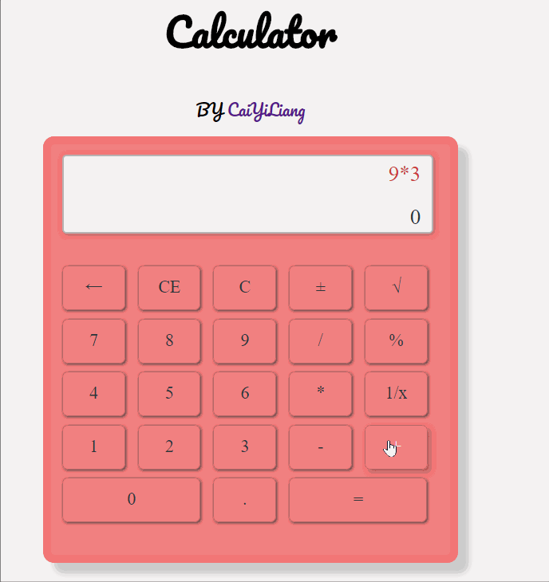

# vue-webpack-calculator

> 用vue.js实现简易计算器<br>
>A simply vue-calculator built by vue2.0 + vue-cli (webpack- simple) ,<br> fast way to get through vue.js , vue-loader and webpack .

# demo


## Build Setup

``` bash
# install dependencies
npm install

# serve with hot reload at localhost:8080
npm run dev

# build for production with minification
npm run build
```
For detailed explanation on how things work, consult the [docs for vue-loader](http://vuejs.github.io/vue-loader).

#todo item
- add keycode eventListener


